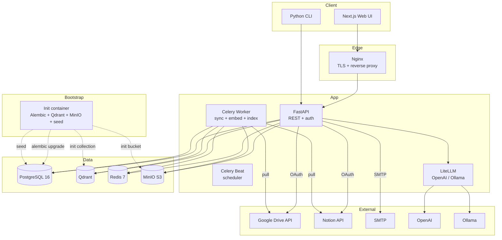

# KnowGate — System Architecture (condensed)

> High-level summary. Full design lives in internal architecture docs (not part of this public repo).

## 1. Style

**Modular monolith:** one Python backend (FastAPI + Celery workers) and one TypeScript frontend (Next.js 14) in a single monorepo. Clear module boundaries so individual services can be extracted to microservices later if scale demands.

Pilot is a small team + community; a microservice mesh would burn engineering time on infra instead of features.

## 2. Topology

## 3. Core Services

| Service | Tech | Responsibility | Scaling |
|---------|------|----------------|---------|
| **API** | FastAPI 0.115 + SQLAlchemy 2 async | REST endpoints, auth (RS256 JWT + argon2id + OAuth PKCE + magic link), 3-role RBAC, audit log, validation | Horizontal (stateless) |
| **Worker** | Celery 5.4 + bge-m3 (CPU) | Sync, parse, chunk, embed, index, eval aggregation | Horizontal (add workers) |
| **Beat** | Celery Beat | Periodic sync poll, cleanup, weekly digest | Single (leader) |
| **Frontend** | Next.js 14 App Router + TS + Tailwind + shadcn/ui | Query UI, admin dashboard, i18n | Horizontal (stateless) |
| **CLI** | Typer (Python) | Terminal query + admin ops | N/A (client-side) |
| **LiteLLM** | LiteLLM proxy | LLM provider abstraction, fallback, cost tracking | Horizontal |
| **PostgreSQL** | Postgres 16 | App data, audit log, RBAC, metadata, FTS | Vertical + read replica |
| **Qdrant** | Qdrant 1.12 | Vector store (HNSW), payload filter for permission | Single → Cluster |
| **Redis** | Redis 7 | Celery queue, cache, rate limit, session | Vertical + Sentinel |
| **MinIO** | MinIO | Original doc files (PDF, docx) for re-process | Distributed mode |

## 4. Data Flow

**Write path (sync):** Beat fires `sync_all_sources` (default every 5 min, configurable via `SYNC_INTERVAL_MINUTES`) → Celery worker enqueues one `sync_source_task` per ACTIVE source → sync engine (`app.sources.sync.run_sync`) loads `Source` row, decrypts `config_encrypted` (AES-256-GCM with `KG_ENCRYPTION_KEY`), builds the connector via `build_connector(source)`, validates credentials (mark source `auth_failed` on auth error), calls `list_changes(cursor)` to discover new/updated/deleted docs → for each doc: skip if `size_bytes > MAX_DOC_SIZE_MB` (default 50 MB), else `fetch_doc` → upload raw bytes to MinIO under `{type}/{source_id}/{doc_id}` → upsert `Document` row by `(source, source_id)` → publish progress event to Redis channel `kg:sync:{job_id}:progress` → mark `SyncJob` `COMPLETED` / `PARTIAL` / `FAILED` → persist next cursor. Drive push notifications land on `POST /api/v1/webhooks/google-drive`; the handler verifies `X-Goog-Channel-Token`, ignores the initial `sync` ping, and enqueues a `sync_source_task(triggered_by="webhook")` for `update` / `exists` states. The SSE endpoint `GET /api/v1/sync-jobs/{id}/stream` (planned) subscribes to the same pub/sub channel and streams JSON frames to the admin dashboard.

**Parse, chunk, embed, and Qdrant upsert** are layered on top of the sync engine in a later work block (ingestion pipeline); the sync engine currently only persists the raw document in MinIO and creates the `Document` row in `discovered` status.

**Read path (query):** User → API auth (JWT) → query rewrite + permission filter (`user.groups ∩ doc.groups`) → embed query (bge-m3, Redis-cached 5 min) → Qdrant hybrid search (vector + payload filter) → rerank (bge-reranker-v2-m3) → LiteLLM call (OpenAI default, Ollama fallback) → answer with citation → log to `queries` table → return.

**Permission invariant:** chunks only reach the LLM if the user is in an access group that the document is also in. Enforced at three layers (API filter, Qdrant payload filter, post-retrieval check) for defense in depth.

**Auth path:** Client → `/api/v1/auth/login` (or `register` / `oauth/{provider}` / `magic-link`) → user authenticated → JWT pair issued (RS256, 15-min access + 30-day refresh with rotation, `jti` claim, `roles` claim) → client sends `Authorization: Bearer <access>` on subsequent requests → `ClientIPMiddleware` (registered after CORS, reads `X-Forwarded-For` first-hop) injects `request.state.client_ip` → endpoint deps `get_current_user` (verifies signature + type + jti-not-revoked) and `require_permission(Permission.X)` (role → permission check). Login is rate-limited (sliding-window in Redis, key = `ip:sha256(email)[:16]`, default 5/15min). OAuth flow uses Authlib `AsyncOAuth2Client` with PKCE; state stored in Redis (5-min TTL) and atomically popped on callback (CSRF defense). Magic-link tokens are 32 random bytes, SHA-256-hashed at rest in Redis, 15-min TTL, one-shot (atomic `GET+DEL` via pipeline). Passwords are argon2id (OWASP 2024 params: `time_cost=3`, `memory_cost=64 MiB`, `parallelism=4`); successful login transparently re-hashes if `needs_rehash()` detects outdated params. OAuth access tokens at rest are encrypted with AES-256-GCM (12-byte nonce, key from `KG_ENCRYPTION_KEY`). Every permission-relevant mutation emits an `audit_log` row (best-effort, non-blocking via `asyncio.create_task`); log writes never raise to keep request flow alive.

## 5. Tech Stack Snapshot

| Layer | Choice | Version | Rationale |
|-------|--------|---------|-----------|
| Backend runtime | Python | 3.12 | Async, type hints, RAG ecosystem |
| Web framework | FastAPI | 0.115+ | Async, OpenAPI auto-gen, Pydantic v2 |
| ORM | SQLAlchemy 2 (async) + Alembic | 2.0 / 1.13 | Mature, type-safe migrations |
| Validation | Pydantic v2 | 2.10+ | FastAPI native |
| Queue | Celery + Redis | 5.4 / 7 | Mature, scheduler built-in |
| LLM gateway | LiteLLM | 1.50+ | OpenAI-compatible for both cloud + Ollama |
| Embedding | bge-m3 (sentence-transformers) | 3.x | Multilingual, MTEB leader, self-host |
| Reranker | bge-reranker-v2-m3 | — | Self-host, multilingual |
| Parser | Unstructured | 0.16+ | PDF/DOCX/PPTX/XLSX/MD/HTML |
| Frontend | Next.js 14 App Router + TS | 14.2+ | RSC, server actions, SEO |
| UI | shadcn/ui + TailwindCSS | latest | Copy-paste, no vendor lock |
| State | Zustand | 4.x | Lightweight |
| Data fetch | TanStack Query | 5.x | Cache, retry, optimistic |
| i18n | next-intl | 3.x | App Router native, ICU |
| Form | Zod | 3.x | TS-first |
| Vector DB | Qdrant | 1.12+ | HNSW, hybrid, payload filter |
| Object storage | MinIO | RELEASE.2024+ | S3-compatible, self-host |
| Auth | authlib + python-jose + argon2-cffi | latest | OAuth + JWT + Argon2 hash |
| Observability | OpenTelemetry + Prometheus + Grafana + Loki | latest | OSS standard |
| Lint (BE) | ruff | 0.7+ | Replaces flake8+isort+black |
| Type (BE) | mypy strict | 1.13+ | Type-safe |
| Test (BE) | pytest + pytest-asyncio + httpx | 8.x | Standard |
| Test (FE) | Playwright | 1.47+ | E2E |
| CI/CD | GitHub Actions | — | Built-in |
| Deploy | Docker Compose + Helm | 24+ / 3.x | Dev + prod K8s |

Full alternatives matrix is tracked internally (see internal architecture doc).

## 6. Deployment Shape

- **Dev / single-host:** `make up` brings up 11 services via Docker Compose (init, api, worker, beat, frontend, postgres, qdrant, redis, minio, mailhog, litellm). The `init` one-shot container runs `alembic upgrade head`, then `python -m scripts.init` (Qdrant collection + MinIO bucket + seed) before the API starts; the API depends on `init: service_completed_successfully`.
- **Prod K8s:** Helm chart with templates for all services, Ingress, PVC, Secrets. Compose → K8s migration is by config swap, not rewrite (Helm on the public roadmap).
- **Public surface:** port 80/443 (Nginx) → API (8000) and Frontend (3000) internal. All other ports (DB, Qdrant, Redis, MinIO) are internal-only.

## 7. API Surface (high-level)

| Group | Endpoints | Auth |
|-------|-----------|------|
| Auth | `/api/v1/auth/{register,login,oauth/{google,github},magic-link,refresh,logout}` | public / user |
| Query | `POST /api/v1/query`, `GET /api/v1/query/history`, `GET /api/v1/query/{id}`, `POST /api/v1/feedback` | user |
| Sources | CRUD + `POST /api/v1/sources/{id}/sync` (admin only); `config_encrypted` is never returned to client | admin |
| Sync jobs | list / detail; SSE progress stream on `/api/v1/sync-jobs/{id}/stream` | admin |
| Webhooks | `POST /api/v1/webhooks/google-drive` (verifies `X-Goog-Channel-Token`, enqueues `sync_source_task(triggered_by="webhook")` on `update`/`exists`; ignores initial `sync` ping) | provider |
| Documents | list / detail / patch / delete / preview | user / editor / admin |
| RBAC | users / roles / groups CRUD + assign | admin |
| Settings | `GET/PATCH /api/v1/settings`, `GET /api/v1/settings/audit-log` | admin |
| Infra | `/health` (liveness), `/ready` (4-backend parallel: PG, Qdrant, Redis, MinIO; 2s timeout each, 200 or 503), `/metrics`, `/api/v1/openapi.json` | public |

~40 routes total. URL path versioned (`/api/v1/`, `/api/v2/`). OpenAPI auto-generated.

## 8. Caching Strategy

| Data | Cache | TTL | Invalidation |
|------|-------|-----|-------------|
| User session | Redis | 15 min (JWT exp) | On logout / role change |
| Query embedding | Redis (hash) | 5 min | TTL only |
| Hot topics widget | Redis (sorted set) | 1 min | On new query |
| LLM response (semantic cache) | Redis | 24h | On doc re-index |
| Rate limit counters | Redis (sliding window) | 1 min | TTL |
| OAuth tokens (encrypted) | Redis (HSET) | until refresh | On revoke |

## 9. Real-Time Strategy

- **Sync progress (admin dashboard):** SSE on `GET /api/v1/sources/sync-jobs/{id}/stream` (route planned for the REST API work block) — one-way push from worker logs (worker publishes JSON to Redis pub/sub `kg:sync:{job_id}:progress`; API endpoint subscribes and forwards as SSE frames; events are best-effort — Redis outage does not break the sync).
- **Query loading (user):** synchronous if < 5s, SSE for long queries.
- **In-app notification toast:** polling every 30s (SSE later if needed).

## 10. Open Decisions (internal ADRs)

Key ADRs established during initial design:
- Modular monolith over microservices.
- Qdrant primary vector DB (over pgvector-only) for hybrid search + payload filter.
- bge-m3 self-host embedding (over OpenAI text-embedding-3) for VI/EN/ZH + cost.
- LiteLLM proxy for OpenAI default + Ollama fallback.
- Both Docker Compose (dev) and Helm (prod K8s) deployment paths.

## 11. See Also

- Project PDR: [[docs/project-overview-pdr.md]]
- Code standards: [[docs/code-standards.md]]
- Deployment guide: [[docs/deployment-guide.md]]
- Codebase summary: [[docs/codebase-summary.md]]
- README: [[README.md]]
